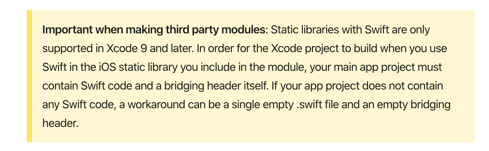

# React-Native plugin for IBM Cloud Push Notifications service

[](https://www.codacy.com/gh/ibm-bluemix-mobile-services/bms-push-react-native?utm_source=github.com&amp;utm_medium=referral&amp;utm_content=ibm-bluemix-mobile-services/bms-push-react-native&amp;utm_campaign=Badge_Grade)

IBM Cloud Mobile Services - Client SDK React Native for Push Notifications service

The [IBM Cloud Push Notifications service](https://cloud.ibm.com/catalog/services/push-notifications) provides a unified push service to send real-time notifications to mobile and web applications. The SDK enables react-native apps to receive push notifications sent from the service. 

Ensure that you go through [IBM Cloud Push Notifications service documentation](https://cloud.ibm.com/docs/services/mobilepush?topic=mobile-pushnotification-gettingstartedtemplate#gettingstartedtemplate) before you start.

## Contents

- [Version History](#version-history)
- [Prerequisites](#prerequisites)
- [Authentication](#authentication)
- [Installation](#installation)
    - [Automatic installation](#mostly-automatic-installation)
    - [Manual installation](#manual-installation)
- [Dependencies](#dependencies)
    - [iOS](#ios)
    - [Android FCM](#android-fcm)
- [Set up SDKs](#set-up-sdks)
    - [iOS](#set-up-ios)
    - [Android](#set-up-android)
- [Initialize SDK](#initialize-sdk)
- [Register for notifications](#register-for-notifications)
- [UnRegister from push](#unregister-from-push )
- [Push Notification service tags](#push-notification-service-tags)
  - [Retrieve tags](#retrieve-tags)
  - [Subscribe to a tag](#subscribe-to-a-tag)
  - [Retrieve subscriptions](#retrieve-subscriptions)
  - [Unsubscribing from tag](#unsubscribing-from-tag)
- [Samples and videos](#samples-and-videos)
- [Contributing](#contributing)

## Version History

* 1.3.0 - Added support for CocoaPods and tokyo region 
* 1.2.0 - Added Android title

## Prerequisites

- Xcode 10+
- Android: minSdkVersion 16+, compileSdkVersion 28+
- React Native >= 0.57.8
- React Native CLI >= 2.0.1

## Authentication
In order to use an IBM Push Notifications service in a your application, you will need to create an instance and authenticate first. The following describes the typical path you need to take to do so.

### Create Instance
Credentials to use an IBM Push Notifications service are obtained via IBM Cloud. You will need an active account and a service instance for the service that you wish to use prior to authenticating in your application.

You can access the service credentials for your instance by taking the following steps:
1. Go to the [IBM Cloud Dashboard](https://cloud.ibm.com) page.
2. Either click an existing Push Notification service instance in your resource list or goto [Catalog](https://cloud.ibm.com/catalog) -> Search for Push Notifications -> fill the required information, select your plan and region and create a service instance
3. Click on the Service Credentials tab in the left navigation bar to get required credentials.

## Installation

### Mostly automatic installation

Install the `bmd-push-react-native` using ,

```JS
$ react-native install bmd-push-react-native
```
You can link the package like this,

````JS
$ react-native link bmd-push-react-native
````

### Manual installation

If you want to link it manually ,

- iOS

1. In XCode, in the project navigator, right click `Libraries` ➜ `Add Files to [your project's name]`
2. Go to `node_modules` ➜ `bmd-push-react-native` and add `RNBmdPushReact.xcodeproj`
3. In XCode, in the project navigator, select your project. Add `libRNBmdPushReact.a` to your project's `Build Phases` ➜ `Link Binary With Libraries`

- Android

1. Open up `android/app/src/main/java/[...]/MainActivity.java`
- Add `import com.bmdpush.react.RNBmdPushReactPackage;` to the imports at the top of the file
- Add `new RNBmdPushReactPackage()` to the list returned by the `getPackages()` method
2. Append the following lines to `android/settings.gradle`:
```
include ':bmd-push-react-native'
project(':bmd-push-react-native').projectDir = new File(rootProject.projectDir,     '../node_modules/bmd-push-react-native/android')
```
3. Insert the following lines inside the dependencies block in `android/app/build.gradle`:
```
compile project(':bmd-push-react-native')
```

## Dependencies

### iOS

#### CocoaPods 

1. Open the `ios` directory and add `use_frameworks!` and `Swift version` in the `Podfile`.
```Swift
  use_frameworks!
  ENV['SWIFT_VERSION'] = '5.0'
```
OR 

```Swift
use_frameworks!

  target 'Your Target Name' do
	  pod 'RNBmdPushReact', :path => '../node_modules/bmd-push-react-native'
  end
  post_install do |installer|
    installer.pods_project.targets.each do |target|
      if ['BMSPush', 'BMSCore', 'BMSAnalyticsAPI'].include? target.name
        target.build_configurations.each do |config|
          config.build_settings['SWIFT_VERSION'] = '5.0'
        end
      end
    end
  end
```
2. run `pod install` and open your `<your-app>.xcworkspace` in Xcode.
3. You need to add an empty Swift file in the app to build it successfully. This is for the swift bridging header. 


### Android FCM

 Create a [firebase project](https://console.firebase.google.com) and add the following bundle ids for android,

  1. Add `your bundle Id` and `com.ibm.mobilefirstplatform.clientsdk.android.push` . Download the `google-services.json` and add inside the `android` ➜ `app`.

  2. In the root `build.gradle` ➜  `buildscript` add the following ,

  ```XML
   repositories {
        google()
        jcenter()
    }
    dependencies {
        classpath 'com.android.tools.build:gradle:3.2.1'
        classpath 'com.google.gms:google-services:4.0.1'
    }
  ```

3. Go to `android` ➜  `app` ➜ `build.gradle` and add the following after `dependencies {....}`,

    ```XML
      apply plugin: 'com.google.gms.google-services'
    ```
    
## Set up SDKs

### Set up iOS 

Open the iOS app in XCode and do the following ,

1. Under the Capabilities section enable the `Push Notifications` 
2. Enable the `Background modes` for `Remote notifications` and `Background fetch`
3. Go to `Build Settings` and make the following changes 

   a. locate `Other Linker Flags` and add `-lc++` , `-ObjC` and `$(inherited)`

Now you can build and run the iOS app from Xcode or using the `react-native run-ios` command.


### Set up Android 

Add the following inside the `AndroidManifest.xml` file .

1. Add  `xmlns:tools="http://schemas.android.com/tools"` in the `<manifest ...> ` tag

For example 
```XML
<manifest xmlns:android="http://schemas.android.com/apk/res/android"
xmlns:tools="http://schemas.android.com/tools" package="com.pushsample">
```

2. Add the following permissions,

```XML
<uses-permission android:name="android.permission.WAKE_LOCK" />
<uses-permission android:name="android.permission.GET_ACCOUNTS" />
<uses-permission android:name="android.permission.USE_CREDENTIALS" />
<uses-permission android:name="android.permission.WRITE_EXTERNAL_STORAGE" />
<uses-permission android:name="android.permission.ACCESS_WIFI_STATE"/>
```

3. Add `tools:replace="android:allowBackup"` inside the `<application ..>` tag

For example 
```XML
<application
android:name=".MainApplication"
android:label="@string/app_name"
android:icon="@mipmap/ic_launcher"
android:allowBackup="false"
android:launchMode="singleTask"
android:theme="@style/AppTheme"
tools:replace="android:allowBackup">
```

4. Add the following inside the `<activity android:name=".MainActivity" ....>`,

```XML
<intent-filter>
<action android:name="yourapp.bundle.IBMPushNotification" />
<category android:name="android.intent.category.DEFAULT" />
</intent-filter>
```

5. Add the following lines,

```XML
<activity android:name="com.ibm.mobilefirstplatform.clientsdk.android.push.api.MFPPushNotificationHandler" android:theme="@android:style/Theme.NoDisplay"/>

<service android:exported="true" android:name="com.ibm.mobilefirstplatform.clientsdk.android.push.api.MFPPushIntentService">
<intent-filter>
<action android:name="com.google.firebase.MESSAGING_EVENT"/>
</intent-filter>
</service>
<service android:exported="true" android:name="com.ibm.mobilefirstplatform.clientsdk.android.push.api.MFPPush">
<intent-filter>
<action android:name="com.google.firebase.INSTANCE_ID_EVENT"/>
</intent-filter>
</service>
```

Now you can build and run the android app from android studio or using the `react-native run-android` command.


## Initialize SDK

Import the following dependecnice ,

```JS
import {Push} from 'bmd-push-react-native';
import { DeviceEventEmitter } from 'react-native';
```

To initialize Push use the following code,

- Initialize without additional options

```JS

// Initialize for push notifications without passing options
Push.init({
    "appGUID":"xxxxxx-xxxx-41xxxx67-xxxxx-xxxxx",
    "clientSecret":"xxxxx-xxxxx-xxxx-xxxxx-xxxxxxx",
    "region":"us-south"
}).then(function(response) {

    alert("InitSuccess: " + response);

}).catch(function(e) {

    alert("Init Error: " + e);

});
```
- Initialize with additional options

```JS
// Initialize for push notifications by passing options
// Initialize for iOS actionable push notifications, custom deviceId and varibales for Parameterize Push Notifications 

var optionsJson = {
    "categories": { 
        "Category_Name1":[{
            "IdentifierName":"IdentifierName_1",
            "actionName":"actionName_1",
            "IconName":"IconName_1"
            },{
            "IdentifierName":"IdentifierName_2",
            "actionName":"actionName_2",
            "IconName":"IconName_2"
            }
        ]},
        "deviceId":"mydeviceId",
        "variables":{"username":"ananth","accountNumber":"536475869765475869"}
    };

Push.init({
    "appGUID":"xxxxxx-xxxx-41xxxx67-xxxxx-xxxxx",
    "clientSecret":"xxxxx-xxxxx-xxxx-xxxxx-xxxxxxx",
    "region":"us-south",
    "options": optionsJson
}).then(function(response) {

    alert("Init Success: " + response);

}).catch(function(e) {

    alert("Init Error: " + e);
});

```

**IMPORTANT: These are the following supported `regions` - `"us-south", "eu-gb" , "au-syd", "eu-de", "us-east", "jp-osa" and "jp-tok"`


## Register for notifications

The following options are supported:

- Register without UserId
    
    ```JS

    // Register device for push notification without UserId
    var options = {};
    Push.register(options).then(function(response) {
      alert("Success: " + response);
    }).catch(function(e) {
        alert("Register Error: " + e);
    });
    ```

- Register with UserId

    ```JS
    // Register device for push notification with UserId

    var options = {"userId":"ananthreact"};
        Push.register(options).then(function(response) {
        alert("Success: " + response);
    }).catch(function(e) {
        alert("Register Error: " + e);
    });
    ```

## UnRegister from push 

```JS
push.unregisterDevice().then(function(response) {
    alert("Success unregisterDevice : " + response);
}).catch(function(e) {
    alert("UnRegister error : " + e);
});
```

## Push Notification service tags

### Retrieve tags

```JS
Push.retrieveAvailableTags().then(function(response) {
    alert("get tags : " + response);
}).catch(function(e) {
    alert("get tags error : " + e);
});
```

### Subscribe to a tag

```JS
Push.subscribe(response[0]).then(function(response) {
    alert("subscribe tags : " + response);
}).catch(function(e) {
    alert("subscribe tags error : " + e);
});
```

### Retrieve subscriptions

```JS

Push.retrieveSubscriptions().then(function(response) {
    alert("retrieveSubscriptions tags : " + response);
}).catch(function(e){
    alert("error retrieveSubscriptions : " + e);
});
```

### Unsubscribing from tag 

```JS
var tag = "tag1";
Push.unsubscribe(tag).then(function(response) {
    alert("unsubscribe tag : " + response);
}).catch(function(e) {
    alert("Error : " + e);
});
```

## Samples and videos

* For samples, visit - [Github Sample](https://github.com/ibm-bluemix-mobile-services/bms-samples-swift-hellopush)

* For video tutorials visit - [IBM Cloud Push Notifications](https://www.youtube.com/playlist?list=PLTroxxTPN9dIZYn9IU-IOcQePO-u5r0r4)

## Contributing

We would love any and all help! If you would like to contribute, please read our [CONTRIBUTING](.github/CONTRIBUTING.md) documentation with information on getting started.

### Learning more

* Visit the **[IBM Cloud Developers Community](https://developer.ibm.com/depmodels/cloud/)**.

* [Getting started with IBM MobileFirst Platform for iOS](https://cloud.ibm.com/docs/mobile)

### Connect with IBM Cloud

[Twitter](https://twitter.com/IBMCloud) |
[YouTube](https://www.youtube.com/watch?v=AVPoBWScRQc) |
[Blog](https://developer.ibm.com/depmodels/cloud/) |
[Facebook](https://www.facebook.com/ibmcloud) |


=======================
Copyright 2020-21 IBM Corp.

Licensed under the Apache License, Version 2.0 (the "License");
you may not use this file except in compliance with the License.
You may obtain a copy of the License at

http://www.apache.org/licenses/LICENSE-2.0

Unless required by applicable law or agreed to in writing, software
distributed under the License is distributed on an "AS IS" BASIS,
WITHOUT WARRANTIES OR CONDITIONS OF ANY KIND, either express or implied.
See the License for the specific language governing permissions and
limitations under the License.
